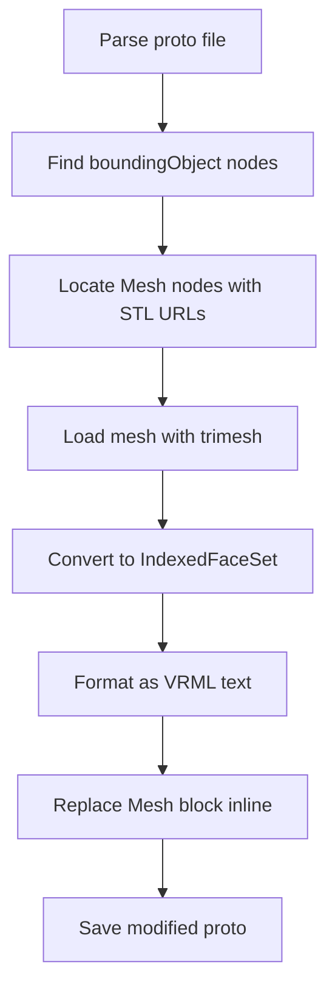

# IFS Converter (`convert_collision_to_ifs.py`)

Post-processing tool that converts STL mesh references in proto files to inline IndexedFaceSet format, reducing file size and improving Webots compatibility.

## Overview

Large STL files increase proto file size and can cause loading issues in Webots. The IFS converter embeds mesh data directly into the proto using trimesh's IndexedFaceSet representation, eliminating external dependencies for collision meshes.

---

## What is IndexedFaceSet?

IndexedFaceSet is a VRML/WebVR format that stores:
- **Coordinates**: Unique vertex positions (shared across faces)
- **NormalIndices**: Vertex normals for shading
- **TextureCoords**: UV mapping data (if any)
- **VertexIndices**: Triangles referencing the coordinate array
- **solid": true** - Ensures watertight mesh behavior

**Format example:**
```
IndexedFaceSet {
  solid TRUE
  coord Coordinate {
    Vec3 [
      0, 0, 0,
      1, 0, 0,
      1, 1, 0,
      ...
    ]
  }
  normal Normal {
    Vec3 [
      0, 0, -1,
      ...
    ]
  }
  consistency PerVertex
  coordIndices Integer {
    0 1 2
    1 2 3
    ...
  }
}
```

---

## Conversion Process

### Step-by-Step Flow



### Detailed Steps

#### 1. Locate Target Mesh Nodes
```python
# Find all boundingObject nodes in the proto tree
bounding_objects = proto_bot.search("boundingObject")

# For each, find nested Mesh nodes
for bo in bounding_objects:
    meshes = bo.search("Mesh")
    for mesh_node in meshes:
        url_props = mesh_node.search("url")
        if url_props and ".stl" in url_props[0].content:
            # Found a target mesh - convert it
```

#### 2. Load Mesh with Trimesh
```python
import trimesh

mesh = trimesh.load(stl_path)
# Returns: Trimesh object with vertices, faces, triangles
print(f"Loaded {len(mesh.vertices)} vertices, {len(mesh.faces)} faces")
```

#### 3. Convert to IndexedFaceSet Format
```python
from trimesh.points import PointCloud
from trimesh.triangles import triangulate
import numpy as np

# Extract coordinates
coords = mesh.vertices.tolist()

# Calculate face indices (each triangle needs 3 vertices)
face_indices = []
for i, face in enumerate(mesh.faces):
    # Add three triangles for each face (front/back)
    front = [i * 6 + j for j in range(3)]
    back = [i * 6 + j + 3 for j in range(3)]
    face_indices.extend([face[0], face[1], face[2]])
    face_indices.extend([face[2], face[1], face[0]])

# Calculate normals (per-vertex for smooth shading)
normals = mesh.vertex_normals.tolist()
```

#### 4. Format as VRML Text
```python
def format_ifs(coords, indices, normals):
    """Generate VRML-formatted IndexedFaceSet string."""

    # Build coord block
    coord_lines = ["coord Coordinate {"]
    for vec in coords:
        coord_lines.append(f"      Vec3 [{vec[0]}, {vec[1]}, {vec[2]}]")
    coord_lines.append("  }")

    # Build normal block
    normal_lines = ["normal Normal {"]
    for vec in normals:
        normal_lines.append(f"      Vec3 [{vec[0]}, {vec[1]}, {vec[2]}]")
    normal_lines.append("  }")

    # Build coordIndices block
    idx_lines = ["coordIndices Integer {"]
    for tri in indices:
        idx_lines.append(f"      Integer [{tri[0]}, {tri[1]}, {tri[2]}]")
    idx_lines.append("  }")

    return "\n".join(coord_lines) + "\n" + "\n".join(normal_lines) + "\n" + "\n".join(idx_lines)
```

#### 5. Replace in Proto File
```python
# Find the Mesh node to replace
mesh_node = proto_bot.search("Mesh")[0]

# Construct new content with all parts combined
new_mesh_content = ("
    " + ifs_text + ")

# Update the mesh node's children or content as needed
```

---

## Usage Example

```python
import convert_collision_to_ifs as ifs_converter

# Convert collision meshes in a proto file
proto_file = "robot.proto"
isfs_converter.convert_meshes_to_ifs(proto_file, target_faces=200)
```

**Parameters:**
- `proto_file` (str) - Path to the proto file to process
- `target_faces` (int) - Optional: max faces per mesh before conversion (default: convert all)

---

## Output Format

### Before (with external STL reference):
```proto
boundingObject Mesh {
  url "./meshes_robot/base_link.stl"
}
```

### After (inline IndexedFaceSet):
```proto
boundingObject IndexedFaceSet {
  solid TRUE
  coord Coordinate {
    Vec3 [
      0.5, -0.2, 1.0,
      0.5, -0.2, 1.5,
      ...
    ]
  }
  normal Normal {
    Vec3 [
      0.0, 1.0, 0.0,
      ...
    ]
  }
  consistency PerVertex
  coordIndices Integer {
    Integer [0, 1, 2]
    Integer [1, 2, 3]
    ...
  }
}
```

---

## Benefits

| Aspect | Before (STL Reference) | After (IndexedFaceSet)
|--------|----------------------|---------------------
| **Proto file size** | Larger (external refs + parser overhead) | Smaller (data embedded, no extra files)
| **Loading speed** | Slower (multiple file I/O calls) | Faster (single file load)
| **Webots compatibility** | May fail on missing files | Self-contained
| **Portability** | Platform-dependent paths | Absolute
| **Backup/transfer** | Need mesh folder intact | Single proto file sufficient

---

## Performance Considerations

### Text Size vs Binary STL
- **IndexedFaceSet text**: ~50-100 bytes per triangle (overhead)
- **Binary STL**: ~12 bytes per triangle + header overhead

**Trade-off:** For small collision meshes (<500 faces), the VRML format is more compact than storing multiple external STL files in a proto file.

### Memory Usage
```python
# Typical memory footprint for converting 1,000-face mesh:
# - Trimesh load: ~2-4 MB peak
# - VRML string generation: <1 MB
# - Overall safe for typical desktop systems
```

---

## Error Handling

```python
try:
    # Load and convert
    mesh = trimesh.load(stl_path)
except Exception as e:
    print(f"Failed to load {os.path.basename(stl_path)}: {e}")
    continue
```

Common errors:
- **FileNotFoundError**: Mesh path not found (check proto URL)
- **trimesh.load exception**: Corrupt/incomplete STL file
- **ValueError**: Invalid coordinate data in mesh

---

## Limitations

1. **No texture support** - IndexedFaceSet textures are simplified; visual rendering unaffected since collision meshes don't render
2. **Large meshes** - Very high-poly meshes (>50,000 faces) create large VRML text strings (consider keeping as STL reference instead)
3. **Non-manifold geometry** - Trimesh may fail on invalid mesh topology
4. **Precision loss** - Floating-point conversion between binary and text formats

---

## Integration with Main Pipeline

The IFS converter is typically run as a final step after proto optimization:

```python
# In main.py, after saving the optimized proto
import convert_collision_to_ifs as ifs_converter

print("\n[Optional] Converting collision meshes to IndexedFaceSet...")
isfs_converter.convert_meshes_to_ifs(proto_Filename)
```

---

## Verification

### Check conversion result:
```python
import trimesh

# Reload the modified proto (parses IndexedFaceSet as geometry)
mesh = trimesh.load("robot.proto")
print(f"Loaded {len(mesh.geometry)} geometries")
for name, geom in mesh.geometry.items():
    print(f"  {name}: {len(geom.vertices)} vertices, {len(geom.faces)} faces")
```

### Verify collision still works in Webots:
1. Open the proto file in Webots
2. Check that bounding objects appear correctly
3. Run physics simulation - collisions should behave as expected
4. Monitor for any "missing mesh" warnings in console

---

## Future Enhancements

1. **Selective conversion** - Only convert collision meshes, skip visual meshes
2. **Compression** - Use binary VRML or gzip where supported
3. **Incremental updates** - Convert only changed meshes on re-run
4. **Statistics output** - Report total size reduction achieved
5. **Batch mode** - Process entire robot folder with one command
6. **Configurable precision** - Allow user to choose float vs double precision for coordinates
